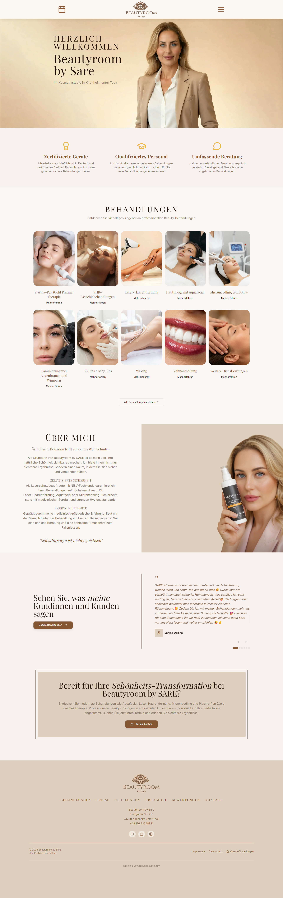
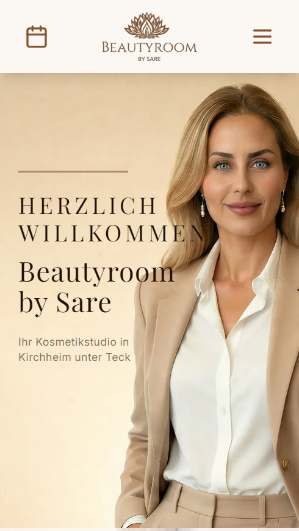
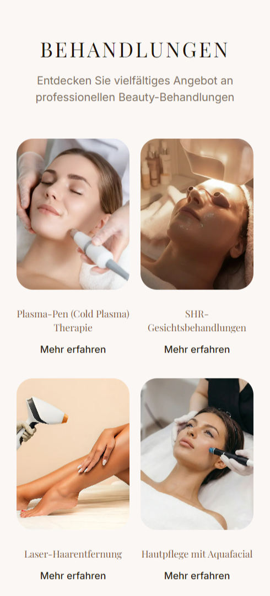
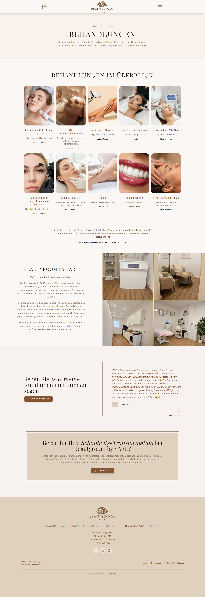
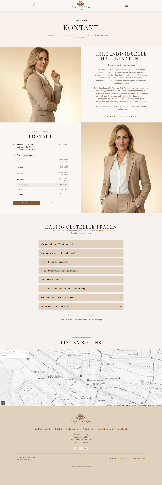
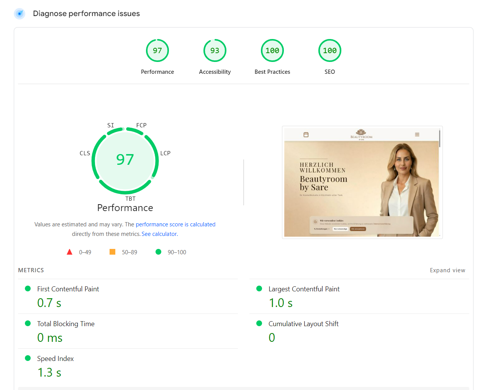

# Beautyroom by SARE — Beauty Studio Website Case Study

A public case study for **Beautyroom by SARE**, a modern beauty studio website created for a local beauty business in Kirchheim unter Teck.

> Note: This is a public case-study repository. It documents the project goals, feature scope, design direction and technical approach. The production codebase remains private.

---

## Overview

**Beautyroom by SARE** needed a professional online presence that matched the quality and premium positioning of the studio. The existing digital presence did not communicate enough trust, was not optimized for mobile visitors and had little local visibility in Google search.

The new website was designed as a modern, elegant and conversion-oriented business website for a beauty studio. It focuses on trust, mobile usability, local SEO and clear service presentation.

**Live website:** [https://beautyroombysare.com](https://beautyroombysare.com)

---

## Project Goals

- Create a premium and trustworthy online presence for the beauty studio
- Improve the mobile experience for potential customers
- Present treatments and services in a clear, structured way
- Support local visibility for Kirchheim unter Teck and the surrounding area
- Build a fast, modern and responsive website
- Add a professional contact and inquiry path
- Prepare the website for GDPR-conscious analytics and cookie consent
- Support long-term maintainability and future content updates

---

## Challenge

Beautyroom by SARE wanted to position itself as a modern beauty studio in Kirchheim unter Teck. The previous online presence did not fully reflect the premium brand quality and was not strong enough for local discovery or mobile-first customer behavior.

Main challenges:

- The design did not match the premium beauty brand positioning
- Mobile visitors had a weak user experience
- Local SEO for Kirchheim unter Teck and the surrounding area was missing or limited
- Potential customers needed a clearer path from service discovery to inquiry
- The website needed to feel professional, elegant and trustworthy from the first impression

---

## Solution

The solution was a modern, elegant and performance-focused website with a strong local SEO foundation.

The website combines a beauty-industry visual direction with practical business goals: clear service categories, strong mobile presentation, structured content and a contact-focused user journey.

Key solution points:

- Premium visual design tailored to the beauty industry
- Mobile-first responsive layout
- Clear treatment/service overview
- Local SEO structure with JSON-LD structured data
- GDPR-conscious cookie consent and analytics setup
- Professional legal page structure with Impressum and Datenschutz
- Clean, conversion-oriented layout for new customer inquiries

---

## My Role

I handled the full web project direction, including:

- UI/UX design direction
- Front-end development
- Responsive implementation
- Component-based page structure
- Beauty-industry visual positioning
- Service and content structure
- Local SEO planning
- Cookie consent and GDPR-related implementation direction
- Deployment and domain-related support

---

## Tech Stack

| Area | Technologies |
| --- | --- |
| Frontend | React, TypeScript, Vite |
| Styling | Tailwind CSS, shadcn/ui, Radix UI |
| Animations | Framer Motion |
| Routing | React Router |
| Forms | React Hook Form, Zod |
| Data Fetching | TanStack Query |
| UI Enhancements | Lucide React, Embla Carousel, Sonner |
| SEO | Meta structure, semantic HTML, JSON-LD structured data |
| Compliance | Cookie consent, Google Consent Mode v2 direction, German legal page structure |
| Platform | Lovable workflow, GitHub version control |

---

## Key Features

### Premium Beauty Studio Design

- Elegant visual language for a beauty brand
- Soft, polished and professional presentation
- Strong first impression for new visitors
- Design direction aligned with trust, calmness and premium service quality

### Mobile-First Experience

- Responsive layout for smartphone, tablet and desktop
- Touch-friendly navigation and section spacing
- Clear service discovery on smaller screens
- Fast, focused path from landing page to inquiry

### Local SEO Foundation

- Local content focus for Kirchheim unter Teck
- Structured data with JSON-LD
- Search-friendly page hierarchy
- SEO-conscious service presentation
- Technical foundation for better discovery in local search

### Treatment & Service Overview

- Clearly categorized beauty treatments
- Easy-to-scan content blocks
- Service-focused page structure
- Trust-building explanation of offerings

### GDPR & Legal Structure

- Cookie consent direction for analytics control
- Google Analytics 4 with Consent Mode v2 direction
- German legal page structure
- Impressum and Datenschutz presentation

### Conversion-Focused User Journey

- Clear calls to action
- Contact/inquiry path for new customers
- Reduced friction on mobile devices
- Professional trust signals throughout the page

---

## Outcome

The result is a modern beauty studio website that communicates professionalism, improves mobile usability and supports customer inquiries.

Main outcomes:

- Stronger premium brand perception
- Improved mobile-first user experience
- Clearer service communication
- Better foundation for local visibility
- Professional and trustworthy online presence
- Website structure focused on lead generation and customer inquiries

---

## Design Direction

The visual direction is elegant, warm and beauty-focused. The website avoids a generic template look and instead presents the studio as modern, personal and professional.

Design principles:

- Soft premium aesthetic
- Clear spacing and readable sections
- Elegant typography and visual rhythm
- Calm, trust-building color direction
- Strong mobile layout
- Polished service presentation
- Subtle animation and interaction details

---

## Architecture Notes

The private production project is built with a modern React/Vite architecture and a reusable component system.

The case study content inside the aysek.dev portfolio is structured with dedicated sections for:

- Challenge
- Solution
- Features
- Outcome
- Call to action
- Technology stack

This makes the project easy to present as a professional case study without exposing private implementation details.

---

## Screenshots

### Desktop Homepage

### Mobile Experience

<table>
  <tr>
    <td width="50%" align="center">
      
    </td>
    <td width="50%" align="center">
      
    </td>
  </tr>
</table>

### Treatment & Contact Pages

<table>
  <tr>
    <td width="50%">
      
    </td>
    <td width="50%">
      
    </td>
  </tr>
</table>

### Performance Preview

---

## What This Project Demonstrates

- Creating a professional website for a local beauty business
- Translating a premium brand direction into a digital experience
- Building a responsive React website with modern UI components
- Structuring service content for clarity and conversion
- Planning local SEO for a real business location
- Combining design quality with practical business goals
- Presenting a private client-style project publicly as a case study

---

## Repository Purpose

This repository is intentionally a **case-study repository**.

It does not contain the private production code. Instead, it documents the project concept, goals, features, design direction and technical approach in a professional way for portfolio, GitHub and freelance platform presentation.

---

## Contact

**Portfolio:** [https://aysek.dev](https://aysek.dev)  
**Live project:** [https://beautyroombysare.com](https://beautyroombysare.com)  
**GitHub:** [AydanKara](https://github.com/AydanKara)

---

**Modern Web Development by aysek.dev**

